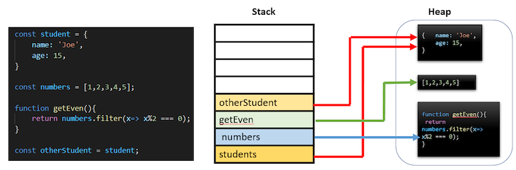

# [Advance javascript](https://zerotomastery.io/cheatsheets/javascript-cheatsheet-the-advanced-concepts/?utm_source=udemy&utm_medium=coursecontent)

### 1. Is it single threaded?
  Yes, It is a single threaded language.

> JavaScript is a *lightweight, interpreted, object-oriented* language with first-class functions, and is best known as the scripting language for Web pages, but it's used in many non-browser environments as well

### 2. interpreter vs compiler?
  Interpreter translates just one statement of the program at a time into machine code. 
  Compiler scans the entire program and translates the whole of it into machine code at once. 
  An interpreter takes very less time to analyze the source code

  Interpreter is convert to byte code and compiler is convert to machine code.

### 3. What is javascript V8 engine? (need clarification)
   V8 engine can understand the JS code and convert it into machine code binary's (011011101). .

### 4. Explain about v8 engine?
  * It is written in C++.
  * In 2008, Google released V8, a new JavaScript engine.
  * The old engin is very slow.
  * For the google map, it is very slow because of zoom in and zoom out, that's why google released V8.

### 5. Who is created first JS engine?
  * Brendan Eich

### 6. Inside JS engin
  <!--  -->
  
  Fig-1

* Parser
  * Lexcial analysis, which is the process of breaking a program into tokens.
* AST (Abstract syntax tree)
  * If you want to see the AST syntax tree, you can use the astexplorer.com

### 7. What is Babel?
  Babel is a JS compiler that takes your modern JS code and returns  browser compatible JS (older JS code).

### 8. What is TypeScript?
  TypeScript is a superset of JavaScript that compiles to clean, readable, and efficient code.
  Once in execution progress, It is compile down to JS

### 9. Heap Memory and Call stack allocation
  * stack used to track the execution line of the program. It is operate in FILO (First In Last Out) order.
  * All the primitive types, like number, Boolean, or undefined will be stored on the stack
  * Heap is the place for reference types like objects, arrays, and functions.


fig-2



fig-3


### 9.1 Stack Overflow:
  If we keep calling the function nested inside of each other, the stack will keep growing and growing.
  When the stack is full, It is called stack overflow.
  
```js
  function recursion(){
    recursion();
  }
  recursion();
  // Uncaught RangeError: Maximum call stack size exceeded
```
### 10. JIT compiler (JUST IN TIME)
  Compline the Interpreter and the Compiler they have created as a JIT compiler. By referring fig-2
  Basically the Interpreter is convert to Byte code. The `Profiler`  checks the Interpreter continuously, If the code comes as repeated, then it will ask compiler to convert into optimize the code.

  * Basically javascript is interpreted language. But by writing the code we can use compiler as well

### 11. Optimize code
  1. Inline catching
```js
  function findUser(user){
    return `fount ${user.firstName} ${user.lastName}`;
  }

  const userData = {
    firstName: 'Sree',
    lastName: 'Kannan'
  }

  findUser(userData);
  /*
    Once run the code, findUser(userData) function becomes  `fount ${user.firstName} ${user.lastName}`;
  */
```

### 12. What is Anonymous?


### 12.1 What is execution context?


Whenever we are run the js file, first the global execution context is created. Global execution context provides the global object `window` and the `this` object. (basically `window` and `this` are the same)

  * It is create a context when function is executing.
  * It is create a context when variable is declared.
  * It is create a context when variable is assigned.
  * It is create a context when variable is referenced.
  
### 13. Garbage collection?


In above image, the pink lines are stack and boxes are heap. If the stack is not pointing any memory, then it will removed from the heep memory.

It is automatic process of removing the unused data. If we are declared some variable inside the function, once the function is executed, the variable will be removed from the memory. It is happening automatically, It is called as a Garbage collection.

### 14. Memory leaks

Here we are created the infinite loop, the array value get increase. In one particular point of time it is exceed the memory. It is called as memory leaks.

```js
let array = [];
// infinite loop
for(let i = 5; i > 1; i++){
  array.push(i-1);
}
```

Major Reason for Memory leaks
  * To many Global variables
  * Keep Adding the Event listeners and forgot to remove later 
  * SetInterval and setTimeout (unless we clear the interval or timeout function the data will not be remove from the memory)

### 15. Web API
Which all are predefined functions this all are called as a web API and they are working as a asynchronous.
```js
window  // type window, which all are functions comes, they all are web api
```
### 16. Event loop and Callback Queue


```js
console.log("1"); // stack execution
setTimeout(() => {  // move to the web api
  console.log("2"); // move to callback queue
}, 0);
console.log("3"); // stack execution

** Output:
1
3
2
```
[Link to view the demo](http://latentflip.com/loupe)

[Line to view the video tutorial](https://www.udemy.com/course/advanced-javascript-concepts/learn/lecture/13760086#overview)

  * First stack will execute the console.log("1");
  * Next line there is setTimeout function, then stack move this into web api to execute. web api can execute only there own function. then it will move to next line. that is console.log("2"); this console not a web api own function. so it is move this into `callback queue` ask stack to execute that line.
  * Then stack will move to next line, console.log("3") and execute it.;
  * Once all the stack is executed. after that only callback queue will execute.
  * Event loop is move the callback queue into stack one by one. (If the stack is empty, then only its moves callback queue into stack)

### 16. Lexical Environment
Lexical environment is the environment where the variable or functions is declared.
The very first lexical environment is the global environment.

```js
function foo(){
  var a = 1;
  function bar(){
    var b = 2;
    function baz(){
      var c = 3;
      console.log(a, b, c);
    }
    baz(); // Lexical environment of baz is bar()
  }
  bar();  // Lexical environment of bar is foo()
}
foo();  // Lexical environment of foo is global
```
### 17. Hoisting
Hoisting is a process of moving the variable declaration to the top of the function. Basically hoisting happens for var variable and the normal function. Basically it is allocated the memory in the beginning itself. 
* If the javascript looks function and the var keyword in the beginning, then it will be hoisted.

```js
function foo(){
  console.log(a); // undefined
  var a = 1;
}
foo();
/*
Here a is undefined, because the variable declaration is moved to the top of the function.
*/

var one = 1;
var one = 2;
console.log(one); // 2
```


### 18. Function expression and function declaration
* Function expression is defined run time (defined means allocate the memory) .
* function declaration is defined compile time.


```js
// Function expression
var sing2 = function(){
  console.log("Lets dance");
}

// Function declaration
function sing(){
  console.log("Lets dance ohhh la la la");
}
```

### How to use javascript optimism, so it is performance is good?
We should avoid this as much as possible. Because this below code JS getting not possible to optimize the code.
* eval()
* arguments
* for in
* with
* delete
* Hidden classes
* Inline caching
  
### 19. Arguments keyword
* Argument is created when the new execution context created in the function.
* If you are try to console arguments in global it will throw error
* If you are try to run with the arrow function, it is will not give the same response like below
```js
function marry(person1, person2){
  console.log(arguments);     // [Arguments] { '0': 'kannan', '1': 'sowmiya' }
  console.log(Array.form(arguments))  // ['kannan', 'sowmiya']
}

marry('annan', 'sowmiya')

/* we should avoid this argument, so JS will convert our code more optimize,
In order to avoid, we can follow the es6 features
*/
function marry(...args){
  console.log(args);    // ['kannan', 'sowmiya']
}

marry('kannan', 'sowmiya')
```

### Variable Environment
```js
function two() {
  var isValid;  // local variable
}

function one() {
  var isValid = true; // local variable
  two();
}

var isValid = false;
one();
```
Explain of the above code

*  first its hosting the `isValid` variable, and assign the value is `undefined`
*  agin it is assign the value as a false
*  Invoke the `one()` function, so it is create new execution context 
*  Inside the `one()` function, it is again happen the hosting, but hoisting happen inside the `one()` function
*  again it is called `two()` function, so this also create the local variable inside the `tow()` function
*  finally the global variable `isValid` will not affect the from the other function, so it is remain the same.

### Scop chain
Normally every function have a variable environment. This variable environment is store the local variable data inside that. for example if you console one value, first it will try to get the data from local environment, if it is not there, then it will try to check from the global environment.

all the local variable environment connect with the global environment, the connection is called as scop chain

### Function scope
```js
if (5> 4){
  var secret = 10012
}
console.log(secret) // 10012
```
we can access the `secret` variable values outside of the condition. Because We only create new environment or scop inside the function only.
```js
function a(){
  var secret = 100;
}
console.log(secret) // throw error
// it is creating new scope, so you can't able to access outside. it is called as function scope
```
### Blok scope
```js
if (5> 4){
  const secret = 10012
}
console.log(secret) // throw error
```
if any variable there inside the carly bracket, then you can't able to access from the outside. It is call Block scop

###  IIFE (Immediate Invoke Function Expression)
```js
// needs to some more depth on this
(function () {

})();
```
If we create IIFE, then the global property will not happened. if any one of the variable there inside, you can't able to access it outside.

### this keyword
`this` keyword is equal to `window` object or global object

### use strick
Basically it is a restriction to the code. ES6 Modules have 'use strict' by default
```js
//1: give methods access to their object
const obj = {
  name: 'kannan',
  sing: function() {
    return `la la la ${this.name}`
  },
  singleAgain(){
    return this.sing() + ' !'
  }
}

console.log(obj.sing());
console.log(obj.singleAgain())
```
2: execute same code for multiple object
```js
function importantPerson() {
  console.log(this.name + '!')
}

const obj1 = {
  name: 'kannan',
  importantPerson
}

const obj2 = {
  name: 'sree',
  importantPerson
}

obj1.importantPerson()  // kannan!
obj2.importantPerson()  // sree!
```


* you can't able to declare the variable with out type for example
  ```js
  function a(){
    name = 100
  } // throw error

  function b(){
    var name = 100
  } // work fine
  ```
* `this` keyword will not work
  ```js
  function a(){
    'use strict'
    console.log(this) // undefined
  }
  ``` 

### Call() Apply() Bind()
`Call() Apply() and Bind()` all are the default function while we create the function. 

`Call() and Apply()` Both are taking `object` as a first parameter and you can receive this object by using `this` keyword.

Only different between `call and apply` is that, `apply` will take second parameter as a array, But `call` will take as normal way

`Bind()` used to store the function inside the variable, for later use
```js
/:Example 1/ 
function testFn() {
  return 'return test value'
}

testFn() // return test value
testFn.call() // return test value
tesFn.apply() // return test value
```
```js
/:Example 2/ 
function testFn(num1, num2) {
  return `Total value is ${ num1 + num2}`
}

testFn(10, 12) // Total value is 22
testFn.call({}, 10, 2) // Total value is 12
tesFn.apply(this, [3, 2]) // Total value is 5
```
```js
/:Example 3/
const myObj = {
  name: 'Kannan',
  age: 31,
  merge(arg1) {
    return `my name is ${this.name} and my age is ${this.age} and my arg is ${arg1}`
  }
}

const objAgain = {
  name: 'sree',
  age: 30
}
myObj.merge(100)  // my name is Kannan and my age is 31 and my arg is 100
myObj.merge.call(100) // my name is undefined and my age is undefined and my arg is undefined
myObj.merge.call(objAgain, 100) // my name is sree and my age is 30 and my arg is 100
const bindStore = myObj.merge.bind(objAgain, 100)
bindStore() // my name is sree and my age is 30 and my arg is 100
```
```js
function multiply(a, b) {
  return a * b;
}

const multiplyByTwo = multiply.bind(this, 2); // first argument is bind
multiplyByTwo(10) // 20 // second argument is passed
const multiplyByTen = multiply.bind(this, 10);
multiplyByTen(21) // 210
```

# this
```js
/:Example 1/
const character = {
  name: 'Simon',
  getCharacter() {
    return this.name;
  }
};
const giveMeTheCharacterNOW = character.getCharacter;
 
//How Would you fix this?
console.log('?', giveMeTheCharacterNOW()); //this should return 'Simon' bud doesn't
```

## Closures and Prototypal Inheritance


## My Questions:
* What is run time environment?
* What is the difference between browser and node?
* What is the old engin before V8?
* What is the first JS engine name
* what every one not use interpreter? because it is slow
* what is the difference between high level language and low level language?
* Different between machine code and byte code?


## Info:
1. How to open snippet in chorme?
  * Inspect the chorme
  * Select source tab
  * In side nav bar Click >> this button and select the snippet
  * Click new snippet
  * write your code
  * run the code ctrl + r


[Markdown reference](https://www.markdownguide.org/basic-syntax/#:~:text=To%20bold%20text%2C%20add%20two,without%20spaces%20around%20the%20letters.&text=I%20just%20love%20**bold%20text**.)


const name = "kannan"
debugger;
const age = 20