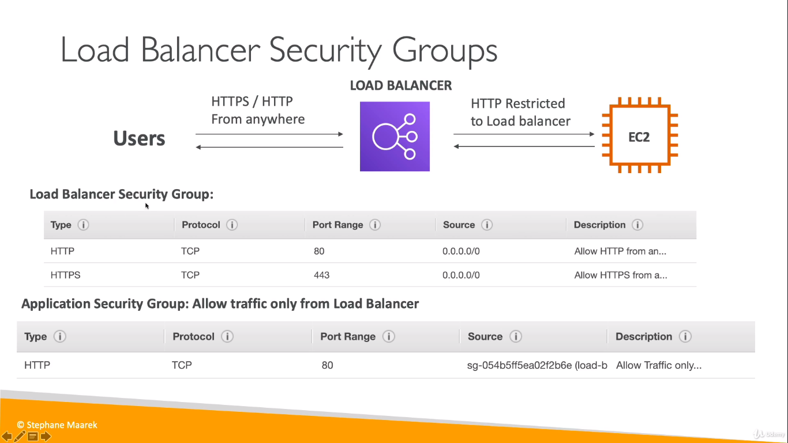

# ELB (Elastic Load Balance)
    Spread load across multiple instance.

## Scalability
1. Vertical Scalability
2. Horizontal Scalability

### Vertical Scalability
    It means increase the size of the instance from t2.micro to t2.large

### Horizontal Scalability
    It means increase the Number of instance from 1 instance to 10 instance
1. Auto Scaling Group
2. Load Balancer

## High Availability
It means running your application in at least 2 data center (Availability Zones)  
The use of high availability is if one sever down in any of the situation then another one will be available, it means our application always available with out any down time.

1. Auto Scaling Group AZ
2. Load Balancer Multi AZ

## Health Check
To check the health of the project
1. It is crucial for Load Balancer
2. They enable the load balancer to know if instance is forwards traffic to are available to replay to request
3. if the response is not 200 (OK), then the instance is unhealthy 
4. It will check every 5sec or 10sec (you can configure)

----
## Type of Load Balancer
1. Classic load Balancer (v1 - Old generation) - 2009   HTTP, HTTPS, TCP
2. Application Load Balancer (v2 - new generation) - 2016   HTTP, HTTPS, WEBSOCKET
3. Network Load Balancer (v2 - new generation) -2016   TCP, TLS (Secure TCP), UDP

 

You can setup internal and external ELBs

----

