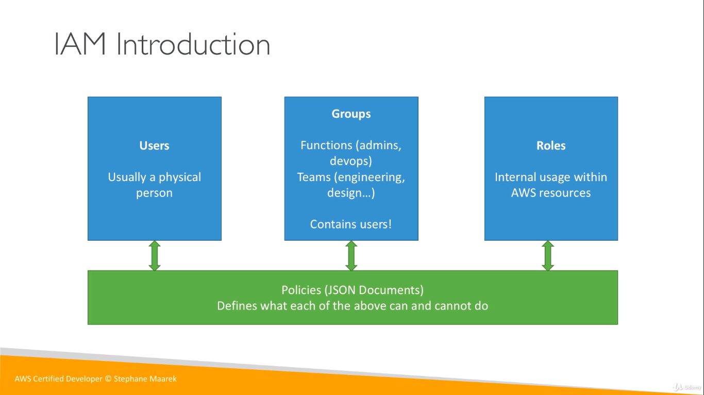

# IAM (Identity and Access Management)

1. Yours whole AWS Security is there:  
* Users 
* Groups
* Roles

2. Root account should never be used (and shared)
3. User must create with proper permission.
4. IAM is at the center of AWS
5. Policies are written in JSON
6. IAM has a global view
7. Permission are governed by policies(JSON)
8. MFA (Multi Factor Authentication) can be setup
9. IAM has predefined "manage policies"

## Create User
Go to IAM and click `Users` in left hand side  `Add User` Fill all the details and click `Create User` finally `Download.csv`

## Create Group
Go to IAM and click `Groups` in the left hand side  and click `Create New Group` fill all the details and click `Create Group`  

select the particular group and add user in the group, then the user also get the permission what all are the permission have in the group.

## password policy
The user should use the policies like password should contain like this character and password should change the particular time period like this.
Go to IAM and click `Access Management => Account Policies` click change `Password Polices` now you can change the password policies. 

-----

### Now user created ###